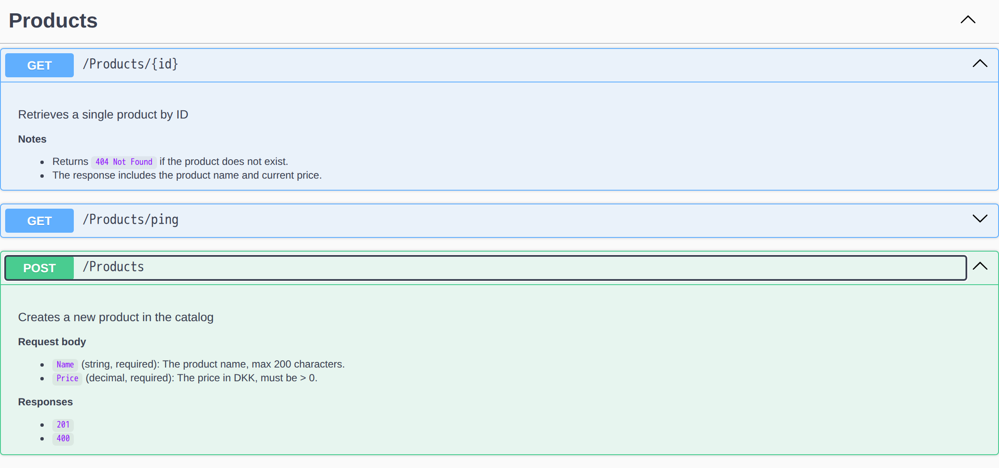

# Swazor
## _Present .NET Swagger UI endpoint descriptions as Razor `.cshtml` templates_

[](https://www.nuget.org/packages/Swazor)
[](https://www.nuget.org/packages/Swazor.SwaggerUi)
[](https://github.com/MirceaMelinte/swazor/actions/workflows/build-test.yml)
[](https://www.apache.org/licenses/LICENSE-2.0)


## Introduction

Swazor renders `.cshtml` Razor templates into HTML and injects the result as the **description** of your ASP.NET Core OpenAPI operations. Those descriptions show up natively in Swagger UI, so each endpoint can carry rich, formatted documentation - paragraphs, headings, lists, tables, inline `code` - authored in real Razor files instead of escaped strings referenced at attribute level.



*The [`samples/Swazor.Sample`](samples/Swazor.Sample) endpoints in Swagger UI: both descriptions are rendered from `.cshtml` templates. The `POST /Products` response codes come from a Razor `@foreach` over the operation's metadata.*

The name originates from a combination of **Swa**gger + Ra**zor**. The library ships as two packages:

| Package | Purpose                                                                                                          |
| :------ |:-----------------------------------------------------------------------------------------------------------------|
| [`Swazor`](https://www.nuget.org/packages/Swazor) | Core: build-time Razor view rendering, OpenAPI operation transformer and registration API.                   |
| [`Swazor.SwaggerUi`](https://www.nuget.org/packages/Swazor.SwaggerUi) | Optional: a tiny CSS layer that polishes how the rendered descriptions look in Swagger UI (light and dark mode). |

## Table of contents

- [Why author descriptions as Razor templates](#why-author-descriptions-as-razor-templates)
- [How it works](#how-it-works)
- [Requirements](#requirements)
- [Installation](#installation)
- [Quick start](#quick-start)
- [Template resolution](#template-resolution)
  - [Naming conventions](#naming-conventions)
  - [Overriding a single endpoint](#overriding-a-single-endpoint)
- [The template model](#the-template-model)
- [Configuration](#configuration)
- [Styling Swagger UI](#styling-swagger-ui)
- [Notes & limitations](#notes--limitations)
- [Acknowledgements](#acknowledgements)
- [References](#references)
- [License](#license)

## Why author descriptions as Razor templates

API descriptions typically live as plain strings - in `[Description]`/`[EndpointDescription]` attributes or in XML doc comments. The moment you want more than a sentence, that approach hurts: HTML has to be escaped inside C# string literals, multi-line content turns into `+`-concatenation or the so-called "string soup", and the documentation ends up tangled in the controller it describes.

Swazor moves the description out of the code and into a `.cshtml` file that sits next to your other endpoint docs:

- **Real HTML, no escaping**: write `<ul>`, `<table>`, `<code>` directly; the markup is the file.
- **Full Razor**: `@foreach`, `@if`, `@` expressions, and the standard MVC Razor features (partials, layouts, tag helpers), with a strongly-typed model describing the operation.
- **Convention-based discovery**: a `Products.GetById` action maps to `Products_GetById.cshtml` automatically; no per-endpoint wiring.
- **Safe by default**: literal markup is emitted as-is, while `@` expressions are HTML-encoded, so model values can't inject markup.
- **No third-party dependencies**: the core `Swazor` package builds only on Microsoft's own `Microsoft.AspNetCore.OpenApi` and the ASP.NET Core shared framework; nothing third-party enters its dependency graph. (The optional `Swazor.SwaggerUi` references Swashbuckle's Swagger UI - the very UI it exists to integrate with)

The templates are authored as real `.cshtml` files and compiled into the assembly at build time. Each render then simply executes the precompiled view.

## How it works

Swazor plugs into the standard ASP.NET Core OpenAPI document pipeline (`Microsoft.AspNetCore.OpenApi`) as an `IOpenApiOperationTransformer`. For every operation in the document:

1. **Resolve a template key** for the operation (see [Template resolution](#template-resolution)).
2. If no key resolves, or no matching `.cshtml` file exists, **leave the operation untouched** (optionally logging a warning).
3. Build an [`OperationDescriptionContext`](#the-template-model) from the operation metadata.
4. **Render** the template to HTML and assign it to `operation.Description`.

Swagger UI then renders that `description` as HTML.

Rendering relies on **build-time compilation** and the framework's own view engine - there is no runtime parsing (now officially obsolete as well), no Roslyn, no third-party templating library:

- **Compile (build time)**: the ASP.NET Core Razor SDK compiles each `.cshtml` into a strongly-typed view class baked into your assembly. A `@model T` directive sets the model type; a view with no `@model` defaults to `dynamic`. Note that a malformed template fails the **build**, not a request.
- **Discover (startup)**: Swazor registers the compiled views of the loaded assemblies as MVC application parts, so each view is resolvable by its path (for example, `/Descriptions/Products_GetById.cshtml`).
- **Render (runtime)**: for each operation, Swazor resolves the matching compiled view by path and executes it through the framework's MVC Razor view engine, writing the output to a string. Literal markup is emitted as-is, while `@` expressions are HTML-encoded.

## Requirements

- **.NET 10** or later. Swazor builds on the `Microsoft.AspNetCore.OpenApi` 10 transformer API and targets `net10.0`.
- Templates are compiled by the **ASP.NET Core Razor SDK**: the Web SDK (`Microsoft.NET.Sdk.Web`) does this automatically; a plain class library or console app needs `<AddRazorSupportForMvc>true</AddRazorSupportForMvc>`.
- An ASP.NET Core app that produces an OpenAPI document via `AddOpenApi()` / `MapOpenApi()`.
- Swagger UI (e.g. `Swashbuckle.AspNetCore.SwaggerUi`) if you want to view the descriptions in a UI - the `Swazor.SwaggerUi` package targets it directly.

## Installation

```bash
dotnet add package Swazor
dotnet add package Swazor.SwaggerUi # optional, for Swagger UI styling
```

```xml
<PackageReference Include="Swazor" Version="1.0.0" />
<PackageReference Include="Swazor.SwaggerUi" Version="1.0.0" />
```

## Quick start

The snippets below demonstrate the runnable [`samples/Swazor.Sample`](samples/Swazor.Sample) project.

### 1. Register Swazor

```csharp
using Swazor.Extensions;
using Swazor.SwaggerUi.Extensions;

var builder = WebApplication.CreateBuilder(args);

builder.Services.AddControllers();

builder.Services.AddSwazor(options =>
{
    options.DescriptionsPath = "Descriptions";
    options.WarnOnMissingTemplate = true;
    options.ValidateTemplatesOnStartup = true;
});

builder.Services.AddOpenApi(options =>
{
    options.AddSwazorDescriptions();
});

var app = builder.Build();

app.MapOpenApi();

app.UseSwaggerUI(options =>
{
    options.SwaggerEndpoint("/openapi/v1.json", "Swazor Sample API");
    options.UseSwazorStyles();
});

app.MapControllers();

app.Run();
```

`AddSwazor()` registers the renderer and options (plus the startup validator). `AddSwazorDescriptions()` adds the operation transformer to the OpenAPI document. `UseSwazorStyles()` injects the optional Swagger UI CSS.

### 2. Write a controller

```csharp
[ApiController]
[Route("[controller]")]
public class ProductsController : ControllerBase
{
    [HttpGet("{id:int}")]
    [ProducesResponseType<Product>(StatusCodes.Status200OK)]
    [ProducesResponseType(StatusCodes.Status404NotFound)]
    public IActionResult GetById(int id)
    {
        var product = new Product(id, "Foo product", 29.99m);
        return Ok(product);
    }

    [HttpPost]
    [ProducesResponseType<Product>(StatusCodes.Status201Created)]
    [ProducesResponseType(StatusCodes.Status400BadRequest)]
    public IActionResult Create([FromBody] CreateProductRequest request)
    {
        var product = new Product(42, request.Name, request.Price);
        return CreatedAtAction(nameof(GetById), new { id = product.Id }, product);
    }
}

public record Product(int Id, string Name, decimal Price);

public record CreateProductRequest(string Name, decimal Price);
```

With the default `Underscore` convention, `ProductsController.GetById` maps to the key `Products_GetById` and `ProductsController.Create` maps to `Products_Create`.

### 3. Author a static description

Templates live under `DescriptionsPath` (default `Descriptions/`). A template that is just HTML needs no `@model`:

`Descriptions/Products_GetById.cshtml`

```cshtml
<div>
    <p>Retrieves a single product by ID</p>
    <h4>Notes</h4>
    <ul>
        <li>Returns <code>404 Not Found</code> if the product does not exist.</li>
        <li>The response includes the product name and current price.</li>
    </ul>
</div>
```

### 4. Author a strongly-typed description

Declare `@model Swazor.Rendering.OperationDescriptionContext` to access the operation's metadata and use the full Razor syntax:

`Descriptions/Products_Create.cshtml`

```cshtml
@model Swazor.Rendering.OperationDescriptionContext
<div>
    <p>Creates a new product in the catalog</p>
    <h4>Request body</h4>
    <ul>
        <li><code>Name</code> (string, required): The product name, max 200 characters.</li>
        <li><code>Price</code> (decimal, required): The price in DKK, must be &gt; 0.</li>
    </ul>
    <h4>Responses</h4>
    <ul>
        @foreach (var responseCode in Model.ResponseCodes)
        {
            <li><code>@responseCode</code></li>
        }
    </ul>
</div>
```

This single template shows strongly-typed model access (`Model.ResponseCodes`), control flow (`@foreach`), mixed HTML and Razor expressions, and HTML entities for special characters.

Run the sample and open Swagger UI (default `http://localhost:5000/swagger`): both operations now render their formatted HTML descriptions, and `POST /Products` lists its response codes dynamically.

## Template resolution

For each operation, Swazor resolves a template key using the first rule that matches:

| Priority | Source | Result                                                     |
| :------: | :----- |:-----------------------------------------------------------|
| 1 | `[SwazorTemplate("Key")]` on the action method | the attribute's key                                        |
| 2 | `operation.OperationId` (when set) | the operation id                                           |
| 3 | Controller + action route values | formatted per the [naming convention](#naming-conventions) |

If none match, the operation is left without a Swazor description.

### Naming conventions

`SwazorOptions.NamingConvention` controls how rule 3 turns a controller/action pair into a key and, therefore, a file path under `DescriptionsPath`:

| Convention | Key for `Products` / `GetById` | File |
| :--------- | :----------------------------- | :--- |
| `Underscore` (default) | `Products_GetById` | `Descriptions/Products_GetById.cshtml` |
| `Subdirectory` | `Products/GetById` | `Descriptions/Products/GetById.cshtml` |

### Overriding a single endpoint

Point one action at a specific template, regardless of convention:

```csharp
[HttpGet("{id:int}")]
[SwazorTemplate("Products_Details")]
public IActionResult GetById(int id) => /* ... */;
```

This renders `Descriptions/Products_Details.cshtml` instead of the convention-derived `Products_GetById`.

## The template model

Templates that declare `@model Swazor.Rendering.OperationDescriptionContext` receive an instance describing the operation being documented:

| Property | Type | Description                                           |
| :------- | :--- |:------------------------------------------------------|
| `OperationId` | `string?` | Operation id from the OpenAPI spec, if set            |
| `HttpMethod` | `string` | HTTP method, for example `GET`, `POST`                |
| `RelativePath` | `string` | Route template, for example `Products/{id}`           |
| `ControllerName` | `string?` | Controller name for MVC controller operations         |
| `ActionName` | `string?` | Action method name for MVC controller operations      |
| `ParameterNames` | `IReadOnlyList<string>` | Names of all parameters on the operation              |
| `ResponseCodes` | `IReadOnlyList<string>` | Declared response status codes                        |
| `Summary` | `string?` | Existing operation summary, if any                    |
| `DocumentName` | `string` | Name of the OpenAPI document the operation belongs to |

## Configuration

`AddSwazor(options => { ... })` configures a `SwazorOptions`:

| Option | Type | Default | Purpose                                                                                                                                                                                                                                  |
| :----- | :--- | :------ |:-----------------------------------------------------------------------------------------------------------------------------------------------------------------------------------------------------------------------------------------|
| `DescriptionsPath` | `string` | `"Descriptions"` | Project-relative folder holding the `.cshtml` templates; it forms the leading segment of the compiled view path (key `Products_GetById` => `/Descriptions/Products_GetById.cshtml`)                                                      |
| `NamingConvention` | `TemplateNamingConvention` | `Underscore` | How a template file is located from an operation's controller/action                                                                                                                                                                     |
| `WarnOnMissingTemplate` | `bool` | `false` | Log a warning for any operation that resolves to a key with no matching file                                                                                                                                                             |
| `ValidateTemplatesOnStartup` | `bool` | `false` | Run the missing-template check once at startup instead of lazily on first request. Surfaces missing templates in boot logs / CI. Has no effect unless `WarnOnMissingTemplate` is also `true`                                             |

## Styling Swagger UI

Swagger UI already renders HTML inside description fields, but a few elements need tweaking to look right against its theme. `UseSwazorStyles()` appends a small, scoped `<style>` block to Swagger UI's `<head>`:

```csharp
app.UseSwaggerUI(options =>
{
    options.SwaggerEndpoint("/openapi/v1.json", "My API");
    options.UseSwazorStyles();
});
```

Basically it's polish on top of Swagger UI, not a styling framework. See [Notes & limitations](#notes--limitations).

## Notes & limitations

- **Build-time compilation.** Templates are compiled into your assembly by the Razor SDK, so the consuming app does not carry Roslyn and does not pay per-request compile cost. However, adding or editing a `.cshtml` requires a **rebuild**, not just a restart.
- **Assembly view discovery.** Rendering uses the MVC Razor view engine and discovers compiled views by scanning loaded assemblies for application parts, so the runtime relies on reflection. Views must live in an assembly that is actually loaded (typically the consuming app's own).
- **Startup validation targets the default document.** `ValidateTemplatesOnStartup` validates the default OpenAPI document (`"v1"`). If you register OpenAPI under a different document name, the eager startup check is skipped - the lazy per-request warning still applies.
- **`UseSwazorStyles()` is intentionally small.** It styles only the elements the descriptions emit and that Swagger UI gets wrong. Richer description HTML (tables, `<pre>`, links) may want additional rules of your own.

## Acknowledgements

Swazor is built on first-party .NET components: the **ASP.NET Core Razor SDK** compiles the `.cshtml` views at build time, the framework's **MVC Razor view engine** renders them, and [`Microsoft.AspNetCore.OpenApi`](https://learn.microsoft.com/aspnet/core/fundamentals/openapi/aspnetcore-openapi) drives the OpenAPI document pipeline. The only third-party dependency is [`Swashbuckle.AspNetCore`](https://github.com/domaindrivendev/Swashbuckle.AspNetCore), referenced by the optional `Swazor.SwaggerUi` package for the Swagger UI it integrates with.

## References

* [ASP.NET Core OpenAPI](https://learn.microsoft.com/aspnet/core/fundamentals/openapi/aspnetcore-openapi) - document generation and transformers
* [Customize OpenAPI documents with transformers](https://learn.microsoft.com/aspnet/core/fundamentals/openapi/customize-openapi)
* [Swashbuckle.AspNetCore](https://github.com/domaindrivendev/Swashbuckle.AspNetCore) - Swagger UI for ASP.NET Core
* [Razor syntax reference](https://learn.microsoft.com/aspnet/core/mvc/views/razor)

## License

Licensed under the [Apache License 2.0](LICENSE).
